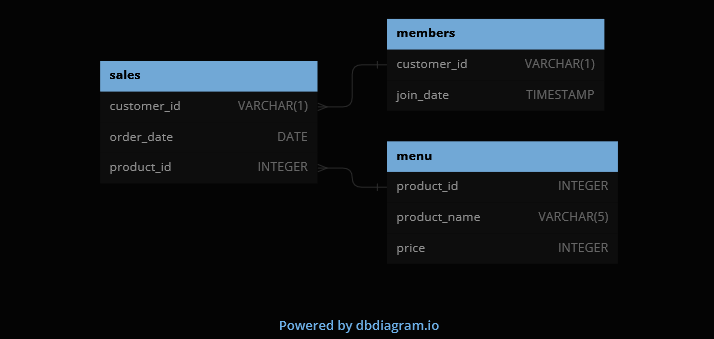

# SQL Challenge Week 1: Danny's Diner
This case study can be found [here](https://8weeksqlchallenge.com/case-study-1/).

Below is the provided entity relationship diagram:

## Case Study Questions
1. What is the total amount each customer spent at the restaurant?
2. How many days has each customer visited the restaurant?
3. What was the first item from the menu purchased by each customer?
4. What is the most purchased item on the menu and how many times was it purchased by all customers?
5. Which item was the most popular for each customer?
6. Which item was purchased first by the customer after they became a member?
7. Which item was purchased just before the customer became a member?
8. What is the total items and amount spent for each member before they became a member?
9.  If each $1 spent equates to 10 points and sushi has a 2x points multiplier - how many points would each customer have?
10. In the first week after a customer joins the program (including their join date) they earn 2x points on all items, not just sushi - how many points do customer A and B have at the end of January?

### 1. What is the total amount each customer spent at the restaurant?
For this we need to access the price of the menu items as well as the sales history, so we will need to use a join on the product_id columns in the sales and menu tables. Then we simply group by the customer_id field and sum the prices of their orders to get our final answer:

|customer_id|total_sales  |
|--|--|
| A | 76 |
| B | 74 |
| C | 36 |

The query used is:

    SELECT
    customer_id, SUM(price) as "total_sales"
    FROM dannys_diner.sales
    JOIN dannys_diner.menu
    ON sales.product_id = menu.product_id
    GROUP BY customer_id
    ORDER BY customer_id;

### 2. How many days has each customer visited the restaurant?
Here we only need the sales table, and we can just select the customer_id field, and use the COUNT() function on the unique order_date values. Again, we then group by the customer_id to get the following:

|customer_id|times_visited|
|--|--|
| A | 4 |
| B | 6 |
| C | 2 |

The query used is:

    SELECT
    customer_id, COUNT(DISTINCT order_date) as "times_visited"
    FROM dannys_diner.sales
    GROUP BY customer_id
    ORDER BY customer_id;

### 3. What was the first item from the menu purchased by each customer?

